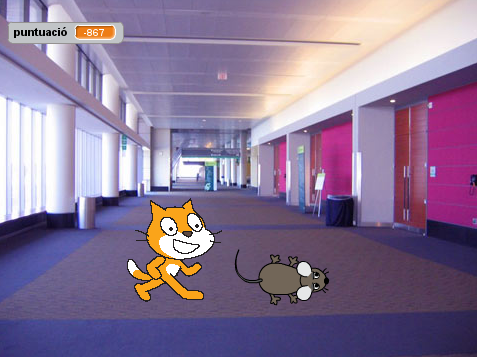

---
title: Fèlix i Herbert
level: Nivell 1
language: ca-ES
stylesheet: scratch
embeds: "*.png"
materials: ["Felix-and-Herbert.sb2", "Resources/*.png"]
...

# Introducció { .intro }

Construirem un joc on __el gat Fèlix__ i el ratolí __Herbert__ juguen a atrapar. Vosaltres controlareu en Herbert amb el ratolí i heu d'intentar evitar que en Fèlix us atrapi. Quant més temps eviteu que us atrapi més punts guanyareu, però no us deixeu agafar perquè perdreu punts!



# Pas 1: En Fèlix segueix el punter del ratolí { .activity }

## Llista de tasques { .check } 

+ Creeu un nou projecte.
+ Feu doble clic a l'escenari i canvieu a la pestanya dels fons, llavors seleccioneu el fons __indoors/hall__. Suprimiu el fons blanc original.
+ Canvieu el nom del personatge per Fèlix.
+ Assegureu-vos que en Fèlix només miri a esquerra utilitzant el bloc __"fixa la rotació a__
+ Creeu aquest programa:
```scratch
	Quan la BANDERA VERDA es premi
	fixa la rotació a [esquerra-dreta v]
	per sempre
		apunta cap a [punter del ratolí v]
		mou-te (10) passos
		següent vestit
		toca el so (62 v) durant (0.3) pulsacions
    end
```
		
## Proveu el projecte { .flag }

Feu clic a la bandera verda.

+ En Fèlix, segueix el punter del ratolí? 
+ Quan es mou, us sembla com si caminés? 
+ Es mou a una velocitat adequada?

## Deseu el projecte { .save }


# Pas 2: En Fèlix persegueix en Herbert { .activity }

A continuació volem que en Fèlix persegueixi en Herbert, enlloc del punter del ratolí.

## Llista de tasques { .check }

+ Creeu un nou personatge escollint, al costat de `Nou personatge:` el botó amb la icona d'una cara. Trieu el personatge **Mouse1** de l'apartat d'animals.
+ Canvieu el nom del personatge per Herbert tocant la `i` blava.
+ Editeu el vestit i feu-l'ho més petit que el de'n Fèlix. Cal fer clic al vestit i arrossegar un dels extrems de la caixa que apareix.
+ Assegureu-vos que en Herbert només miri a esquerra i dreta utilitzant el bloc __"fixa la roació a"__.
+ Doneu-li aquest programa a en Herbert:
```scratch
    Quan la BANDERA VERDA es premi
	fixa la rotació a [esquerra-dreta v]
	per sempre
		vés a [punter del ratolí v]
		apunta cap a [Fèlix v]
    end
```

### Proveu el projecte

Feu clic a la bandera verda.

+ En Herbert, segueix el punter del ratolí? 
+ En Fèlix persegueix al Herbert?

# Pas 3: En Fèlix diu quan ha atrapat en Herbert  { .activity }

Volem que en Fèlix sàpiga quan ha atrapat en Herbert i que ens ho digui.

## Llista de tasques { .check }

+ Modifiqueu el programa d'en Felix així:
```scratch
	Quan la BANDERA VERDA es premi
	fixa la rotació a [esquerra-dreta v]
	per sempre
		apunta cap a [punter del ratolí v]
		mou-te (10) passos
		següent vestit
		toca el tambor [3 v] durant (0.3) pulsacions
		si <tocant [Herbert v]?> llavors
		    digues [Atrapat!] durant (1) segons
		end
	end
```

## Proveu el projecte { .flag }

Feu clic a la bandera verda.

+ En Fèlix diu quan ha atrapat en Herbert?

## Deseu el projecte { .save }


# Pas 4: En Herbert es converteix en un fantasma quan l'atrapen { .activity }

En lloc de que en Fèlix digui quelcom, volem que en Herbert es converteixi en un fantasma quan l'atrapin.

## Llista de tasques { .check }

+ Canvieu el programa d'en Fèlix per tal d'enviar aquest missatge quan atrapi en Herbert.
```scratch
	Quan la BANDERA VERDA es premi
	per sempre
		apunta cap a [punter del ratolí v]
		mou-te (10) passos
        mou-te (20) passos
        següent vestit
		toca el tambor [3 v] durant (0.3) pulsacions
		si <tocant [Herbert v]?> llavors
            envia a tots [atrapat v]
			toca el tambor [17 v] durant (0.2) pulsacions
			espera (1) segons
        end
	end
```

+ Importeu un nou vestit per en Herbert de __fantasy/ghost2-a__.
+ Editeu-l'ho per fer-lo més petit. N'hi hauria d'haver prou amb sis clics al botó __encongir__.
+ Canvieu els noms dels vestits d'en Herbert de manera que vestit de ratolí s'anomeni __'viu'__ i el de fantasma __'fantasma__'.
+ Creeu un nou programa per tal de convertir en Herbert en un fantasma:
```scratch
    quan rebi [atrapat v]
       canvia el vestit a [fantasma v]
       espera (1) segons
       canvia el vestit a [viu v]
```

## Proveu el projecte { .flag }

Feu clic a la bandera verda.

+ Quan atrapeu en Herbert, es converteix en un fantasma?
+ En Fèlix fa els sons adequats en cada moment?
+ En Fèlix roman quiet prou temps per a que en Herbert es pugui escapar?


## Deseu el projecte { .save }


# Pas 5: Actualitzar el marcador

Afegirem un marcador de manera que sabrem com de bé mantenim al Herbert en vida. Començarem amb el marcador a zero i l'incrementarem una unitat cada segon. Si en Fèlix atrapa en Herbert, reduirem el marcador en cent unitats.

## Llista de tasques { .check }

+ Cliqueu l'apartat `Dades` { .blockorange }, i creeu una variable de nom `puntuació` { .blockorange }, fixant-vos en seleccionar la opció "per a tots els personatges". 

+ Creeu aquests dos programes a l'escenari:
```scratch
    Quan la BANDERA VERDA es premi
       assigna a [puntuació v] el valor [0]
       per sempre
          augmenta [puntuació v] en (1) 
          espera (1) segons
       end
		
	quan rebi [atrapat v]
       augmenta [puntuació v] en (-100)
```

## Proveu el projecte { .flag }

Feu click a la bandera verda.

+ El marcador, augmenta una unitat per segon?
+ Quan en Fèlix atrapa en Herbert, el marcador disminueix cent unitats?
+ Què passa quan atrapeu en Herbert abans que el marcador arrivi a cent unitats? 
+ Quan comenceu una nova partida, el marcador torna a zero?

## Deseu el projecte { .save }

Molt bé, heu acabat! Ara ja podeu gaudir del joc!

No us oblideu que podeu compartir el joc amb amics i familiars fent clic a **Comparteix** al menú!
