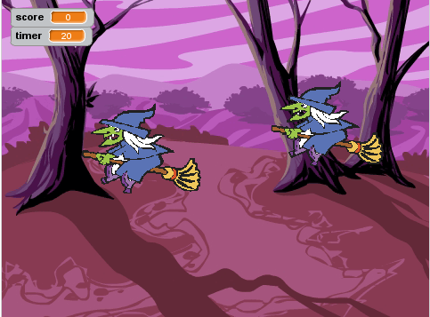

---
title: Caça la bruixa
level: Nivell 1
language: ca-ES
stylesheet: scratch
embeds: "*.png"
...

# Introducció { .intro }

Aquest projecte s´inspira en el joc de fira d´origen anglès anomenat  __Whack-a-Mole__. Obtindreu punts en clicar les bruixes que apareixen a la pantalla. L'objectiu del joc és obtenir el màxim de punts en 30 segons!



# Pas 1: Crear una bruixa que voli { .activity }

[](http://www.youtube.com/watch?v=eIPimTAu1tU)

## Llista de tasques { .check }

+ Comenceu un nou projecte de Scratch. 
+ Esborreu el personatge del gat i afegiu un nou fons d'escenari carregant el que trobareu a __natura/woods__.
+ Feu servir el botó  __escull un personatge des d’un fitxer__  per afegir la bruixa al projecte (vestit  __fantasia/witch1__). El primer que farem és fer que es mogui.
+ Afegiu una variable només per aquesta animació que es digui `velocitat` { .blockorange }. 
+ A l´escenari,  el monitor d’aquesta variable ha de dir  “Personatge1 velocitat”. Si només diu “velocitat”,  elimineu la variable i torneu-la a crear, però només per aquesta animació. Desmarqueu la casella de la variable a la paleta de variables perquè no es vegi a l’escenari. La variable velocitat controlarà la velocitat de la bruixa. Fem servir una variable, perquè així més endavant podrem canviar la velocitat.
+ El primer que volem és  que la bruixa es comenci a moure en començar el joc. Per fer-ho escriviu aquest script:
```scratch
	quan la BANDERA VERDA es premi
       assigna a [velocitat v] el valor [5]
       per sempre
          mou-te (velocitat) passos
```		

## Proveu el projecte { .flag }
 
Feu clic a la bandera verda per veure què fa la bruixa.

Com és que s'encalla a la vora de la pantalla?

## Deseu el projecte { .save }

## Llista de tasques { .check }

+ Per tal de que la bruixa no s'encalli, feu que giri cua en tocar la vora de la pantalla. Sota el bloc __"mou-te velocitat passos"__ afegiu-hi el bloc  __"rebota en tocar una vora"__.

+ A més a més, per tal que la bruixa no es giri de caps per avall, utilitzeu el bloc __"fixa la rotació a"__ on seleccionarem esquerra-dreta.
```scratch
	quan la BANDERA VERDA es premi
	   fixa la rotació a [esquerra-dreta v]
       assigna a [velocitat v] el valor [5]
       per sempre
          mou-te (velocitat) passos
	      rebota en tocar una vora
```	


## Proveu el Projecte { .flag }

Feu clic a la bandera verda.

+ Comproveu que la bruixa es mou de banda a banda de la pantalla.

## Deseu el projecte { .save }

## Per saber-ne més { .try }

+ Proveu de canviar el valor de la velocitat per fer que la bruixa vagi més ràpida o més lenta.
 
+ Com us ho faríeu per fer que la bruixa voli cada vegada més ràpid? (Fer que la bruixa vagi cada cop més ràpid té truc, no us preocupeu si no veieu la manera de fer-ho. Anirem donant més pistes al llarg del projecte.)

# Pas 2: Fer desaparèixer la bruixa en qualsevol moment { .activity }

[](http://www.youtube.com/watch?v=8MELwGG2deg)

Per fer el joc més interessant, farem que la bruixa aparegui i desaparegui en qualsevol moment. Crearem un altre script que corri al mateix temps que es mou la bruixa. El nou script amagarà la bruixa durant un temps qualsevol, llavors la mostrarà durant un altre interval de temps, i ho anirà repetint per sempre (o fins que s'acabi el joc). 

## Llista de tasques { .check }

+ Creeu aquest script per la bruixa:
```scratch
    quan la BANDERA VERDA es premi
    per sempre
       amaga
       espera (nombre a l'atzar entre (2) i (5)) segons
       mostra
       espera (nombre a l'atzar entre (2) i (5)) segons
    end
```

## Proveu el projecte { .flag }

Feu clic a la bandera verda.

+ Comproveu si la bruixa es segueix movent de banda a banda de la pantalla.
+ Apareix i desapareix en qualsevol moment?

## Deseu el projecte { .save }

## Per saber-ne més { .try }

+ Proveu de canviar el rang dels nombres a l'atzar. Què passa si agafeu números molt grans? i molt petits? (Potser això us dóna alguna pista de com fer que la bruixa voli més ràpid a mesura que passa el temps …)

# Pas 3: Fer que la bruixa desaparegui al clicar-la { .activity }

[](http://www.youtube.com/watch?v=xmNAlvXwYL0)
 
Per fer que això sigui un joc, hem de donar als jugadors alguna cosa a fer. Hauran de clicar damunt la bruixa per fer-la desaparèixer. Quan li facin clic a sobre, volem que desaparegui i que s'escolti un so.

## Llista de tasques { .check }

+ A la pestanya __Sons__,  importeu el so  __electrònic/fairydust__.

+ Afegiu aquest script a la bruixa:
```scratch
	quan es cliqui aquest personatge
	  amaga
	  toca el so [Fairydust v]
```

## Proveu el projecte { .flag }

Feu clic a la bandera verda.

+ Comproveu que la bruixa desapareix i produeix el so escollit en clicar-la.

## Deseu el projecte { .save }

# Pas 4: Afegir un marcador i un cronòmetre { .activity }

[](http://www.youtube.com/watch?v=wC_SnFdUoYQ)

Tot i que ja tenim llesta la  bruixa, el nostre objectiu és crear un joc! Afegirem un marcador que ens servirà per anar anotant els punts cada cop que cliquem a sobre de la bruixa abans no s'acabi un temps. Per tant, necessitarem una variable per al temps i una altra per al marcador.

+ Creeu una nova variable __per tots els personatges__ que es digui **marcador** i retoqueu l'script perquè s'incrementi en un punt el marcador cada cop que s'atrapa la bruixa.
```scratch
	quan es cliqui aquest personatge
       amaga
       toca el so [Fairydust v]
       augmenta [marcador v] en (1)
```

+ Aneu a l'**escenari** i creeu una nova variable (aquesta __només per l'escenari__) que es digui __temps__. 
+ Afegiu un script que posi `temps` { .blockorange } a 30 i el marcador a 0 al prémer la bandera verda. Feu servir un bloc __repeteix fins que__ per esperar un segon i reduir el temps un segon. Això s'hauria de repetir fins que `temps` { .blockorange } arribi a 0. En arribar a zero, cridarem `atura tot` { .blockyellow } per aturar el joc.
```scratch
	quan la BANDERA VERDA es premi
       assigna a [temps v] el valor (30)
       assigna a [marcador v] el valor (0)
       repeteix fins <(temps) = [0]>
          espera (1) segons
          augmenta [temps v] en (-1)
       end
       atura [tot v]
```

## Proveu el projecte { .flag }
	
Feu clic a la bandera verda.

## Deseu el projecte { .save }

## Per saber-ne més { .try }

+ Sabeu ja com fer-ho perquè la bruixa vagi cada vegada més i més ràpid?

__Molt bé, heu completat el joc bàsic!!! Hi ha més coses que es poden fer, però. A veure si us atreviu amb el repte següent!__

## Repte: Afegir més bruixes { .challenge }

Si tenir una bruixa ja està genial, tenir-ne més encara serà millor! Anem a posar 3 bruixes voladores.

1. Dupliqueu la bruixa prement el botó dret del ratolí damunt la llista de personatges.
2. Ajusteu la mida de cada bruixa, perquè tinguin dimensions diferents.
3. Canvieu la variable velocitat de cada bruixa per fer que volin a velocitats diferents.
4. Per tal que no estiguin juntes, moveu-les a diferents punts de l'escenari. 
 
## Proveu el projecte { .flag }

Feu clic a  la bandera verda.

+ Teniu unes quantes bruixes movent-se d'un costat a l'altre de l'escenari? 
+ Apareixen i desapareixen a l'atzar? 

## Deseu el projecte { .save }

## Per saber-ne encara més { .try }

+ Quin creieu que seria el número de bruixes ideal per aquest joc?
+ Podríeu canviar l'aspecte de les bruixes? Proveu d'editar-ne els vestits, o utilitzar els blocs d'efectes de la paleta Vestits.
+ Podríeu fer que algunes bruixes donessin més puntuació que d’altres?

# 

__Ben fet, heu completat el joc, ara a jugar!!!__

Recordeu que podeu compartir el joc amb els vostres amics i família prement __Compartir__ a la barra de menú!
