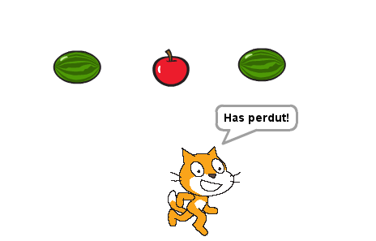

---
title: Màquina de Fruita
level: Nivell 2
stylesheet: scratch
language: ca-ES
embeds: "*.png"
materials: "*.sb2"
...

# Introduccció { .intro }

Aquest és un joc semblant a les màquines escurabutxaques. Consisteix en anar canviant el vestit de tres personatges fins que els tres mostrin la mateixa imatge. 



<!-- 
////////////////////////////////////////////////////////////////////// 
////////////////////////////////////////////////////////////////////// 
-->

# Pas 1: Crear un personatge que canviï de vestit { .activity }

## Llista de tasques { .check }

**Anem a importar imatges diferents per el nostre joc**

+ Comenceu un projecte d'Scratch nou. Esborreu el gat clicant amb el botó de la dreta i triant **Esborra**.
+ Primer de tot afegim un fons de la galeria per a l'escenari. Escolliu el fons **rays** de la categoria **Altres** i llavors esborreu el fons blanc original.
+ Importeu un nou personatge
+ Trieu qualsevol imatge de qualsevol carpeta. Nosaltres hem utilitzat **coses/bananas1**, però podeu triar qualsevol imatge que us agradi.
+ Cliqueu la '**i**' blava del personatge i canvieu-li el nom a 'Fruita1'.
+ Cliqueu la pestanya Vestits i importeu dues coses més. Ara ja teniu 3 personatges (nosaltres vam utilitzar **animals/bee1** i **coses/lego**, però podeu utilitzar el que us vingui més de gust).

Ara que tenim els vestits, volem que el personatge se'ls vagi canviant.

<!-- 
////////////////////////////////////////////////////////////////////// 
////////////////////////////////////////////////////////////////////// 
-->

# Pas 2: Fer que les imatges vagin canviant { .activity }

## Llista d'activitats { .check }

+ Cliqueu la pestanya de `Programes`.
+ Seleccioneu Control i arrossegueu el bloc  `quan la bandera verda es premi` { .blockyellow }. El que poseu a continuació passarà cada vegada que el jugador premi la bandera verda.
+ De la paleta **Control**, afegiu el bloc  `per sempre` { .blockyellow } de manera que s'enganxi a sota.
+ **Cliqueu la bandera verda** a dalt a la dreta. Fixeu-vos que ara apareix una petita ombra blanca al voltant del nostre programa. Això significa que  el nostre programa està corrent perquè hem clicat la bandera verda.
+ Ara cliqueu la paleta `Aspecte` i arrossegueu dins del bloc `següent vestit` { .blockpurple }
+ Com alentiríem el programa perquè no canvii de vestit tant ràpidament? Cliqueu a la paleta de  `Control` i arrossegueu el bloc `espera 1 segons` { .blockyellow }
+ Ajusteu el temps fins que el canvi a un pas més ràpid (normalment, un temps de 0.1s és suficient). Què passaria si no haguéssim posat el bloc `espera 1 segons` { .blockyellow }?
```scratch
   quan la BANDERA VERDA es premi
   per sempre		
      següent vestit
      espera (0.1) segons
```

## Proveu el projecte { .flag }

**Premeu la bandera verda.**

Els vestits canvien a una velocitat raonable? 

## Deseu el projecte { .save }

## Per saber-ne més { .try }

+ Ajusteu el temps en el bloc `espera 0.1 secs` { .blockyellow }.
+ Quin temps penseu que faria el joc massa fàcil o massa difícil?

<!-- 
////////////////////////////////////////////////////////////////////// 
////////////////////////////////////////////////////////////////////// 
-->

# Pas 3: Fer que els personatges deixin de canviar de vestit al clicar-hi a sobre { .activity }

## Llista d'activitats { .check }

Perfecte! Ara farem que el personatge canvii el vestit per sempre, però com ho fem perquè parin de canviar de vestit quan hi cliquem a sobre?

+ Creeu una nova variable clicant a la paleta `Dades` i després al botó `Crea una Variable`. Anomeneu-la `parat` { .blockorange } i seleccioneu la opció **"Només per aquest personatge"**, i també desmarqueu la caixeta al costat de la variable perquè no es vegi a l'escenari.

+ Al principi del joc, el personatge no haurà estat clicat i per tant posarem el valor de la variable a **0**.
```scratch
   quan la BANDERA VERDA es premi
      assigna a [parat v] el valor [0]
      per sempre
         següent vestit
         espera (0.1) segons
```   

+ Ara posarem la variable `parat` { .blockorange } a **1** quan algú clica el personatge.
```scratch
   quan es cliqui aquest personatge
      assigna a [parat v] el valor [1]
```    

+ Finalment, hem d'aturar els canvis de vestit quan la variable `parat` { .blockorange } tingui el valor "1". Afegiu un bloc `si...llavors` { .blockyellow } i un bloc de **comparació** `[] = []` { .blockgreen } (a la paleta dels *Operadors*) per mirar si `parat` { .blockorange } està a "0".
```scratch
   quan la BANDERA VERDA es premi
   assigna a [parat v] el valor [0]
   per sempre
      si <(parat) = [0]> llavors
         següent vestit
         espera (0.1) segons
```

## Proveu el projecte { .flag }

Premeu bandera verda, espereu un moment i després cliqueu un personatge.

+ Canvia el vestit abans de clicar-lo?
+ S'atura quan el cliqueu?
+ **Engegueu el programa un altre cop**. S'atura quan poseu el ratolí a sobre, però sense clicar?
+ S'atura si cliqueu a qualsevol lloc de l'escenari?
+ I si cliqueu sobre algun altre lloc sobre la finestra d'Scratch? 
+ I fora de la finestra d'Scratch?

## Deseu el projecte { .save } 

<!-- 
////////////////////////////////////////////////////////////////////// 
////////////////////////////////////////////////////////////////////// 
-->

# Pas 4: Crear els altres personatges { .activity }

Ara necessitem crear els altres personatges per tal de poder jugar al nostre joc!

+ **Dupliqueu el personatge** (Fruita1) clicant-hi a sobre amb el botó dret.
+ Dupliqueu-lo una altra vegada. Ara heu de tenir 3 personatges sobre l'escenari.
+ Anomeneu-los **Fruita1**, **Fruita2** i **Fruita3**
+ Moveu cada personatge per tal que estiguin en línia. Feu-los una mica més petits si ho necessiteu.

## Proveu el projecte { .flag }

Premeu bandera verda. Totes les animacions haurien de canviar. Proveu de parar-les totes de cop!

## Deseu el projecte { .save }

<!-- 
////////////////////////////////////////////////////////////////////// 
////////////////////////////////////////////////////////////////////// 
-->

# Pas 5: Posar un vestit a l'atzar a cada personatge { .activity }

Anem a fer que quan es premi la bandera verda, cada personatge comenci amb un vestit a l'atzar.

Quan engegueu el joc just després de carregar-lo, tots els personatges mostren el mateix vestit i canvien plegats. Seria més interessant (i difícil) si canviessin de forma menys predictible.

## Llista d'activitats { .check }

+ Si mireu la pestanya `Vestits` per a un personatge veureu que els vestits estan numerats.
+ Per fer que un personatge comenci amb un cert vestit, anem a afegir un bloc `canvia el vestit a ...` { .blockpurple } amb un `nombre a l'atzar entre (1) i (3)` { .blockgreen } (de la paleta **Operadors** verda), per escollir el número del vestit.
+ També podem fer servir aquest bloc en el `per sempre` { .blockyellow } i així el personatge canviï sempre a un vestit diferent cada vegada.
```scratch
   quan la BANDERA VERDA es premi
      assigna a [parat v] el valor [0]
      canvia el vestit a <nombre a l'atzar entre (1) i (3)>
      per sempre
         si <(parat) = [0]> llavors
            canvia el vestit a <nombre a l'atzar entre (1) i (3)>
            espera (0.1) segons
```

+ Fes el mateix per a tots els personatges.

## Proveu el projecte { .flag }

Clica la bandera verda. Tots els personatges haurien de canviar de vestit de forma impredictible.

+ Com s'hauria de canviar el programa si afegim un altre vestit?

## Deseu el projecte { .save }

## Per saber-ne més { .try }

**Fer el joc més difícil**

Canvieu la dificultat del joc una mica. Una cosa fàcil és canviar la rapidesa amb la que canvien els vestits. Però podem pensar alguna cosa més imaginativa?

Algunes idees:

+ Canvieu el número de vestits que té cada personatge.
+ Feu que alguns personatges tinguin vestits únics.
+ Que els temps entre els canvis de vestit siguin diferents.

Divertiu-vos pensant coses pel vostre compte! Cada cop que feu un canvi, penseu si fa el joc més fàcil o més difícil. És el joc massa difícil o massa fàcil? Com podeu ajustar la dificultat de forma que sigui la justa?


<!-- 
////////////////////////////////////////////////////////////////////// 
////////////////////////////////////////////////////////////////////// 
-->

# Pas 6: Mostrar un missatge quan el joc s'ha acabat. { .activity }

Anem a mostrar el missatge "Game Over" quan el joc s'hagi acabat.

## Llista d'activitats { .check }

Primer, anem a crear un fons diferent per mostrar quan el joc s'hagi acabat.

+ Cliqueu a l'escenari i després a la pestanya `Fons`. Canvieu el nom del fons actual per **"Jugant"**.
+ Dupliqueu el fons i afegiu un text a la còpia que posi **"Game Over"**. Podeu canviar el tamany del text clicant-lo i arrossegant alguna de les cantonades. Poseu el nom **"Game Over"** a aquest fons.
+ Cliqueu a la pestanya `Programes` per a l'escenari i feu que el fons "Jugant" sigui el que s'utilitza quan el joc comença.
+ Com podem detectar quan tots els personatges s'han parat? Recordeu que hem utilitzat la variable `parat` { .blockorange } per saber si un personatge ha estat clicat? Anem a mirar la variable `parat` { .blockorange } per al personatge **Fruit3** per veure si el joc s'ha acabat. Seleccioneu el personatge Fruit3 i busqueu el bloc `[posicio x] de [Fruit3]` { .blockblue } de la paleta `Sensors` {
.blocklightgrey }, però canviant **posició x** a `parat` { .blockorange }.
```scratch
   quan la BANDERA VERDA es premi
      canvia el fons a [Jugant v]
      per sempre
         si <([parat v] de [Fruita3]) = [1]> llavors
            canvia el fons a [Game Over v]
```

## Proveu el projecte { .flag }

Cliqueu la bandera verda. Apareix el missatge "Game Over" quan cliqueu el tercer personatge?

Què succeeix si pareu la Fruita3 abans d'haver parat els dos altres personatges? Anem a modificar el programa per tal que funcioni independentment de l'ordre en què es cliquin els personatges.

+ Per mirar que **tots tres** personatges tenen la variable `parat` { .blockorange } amb el valor **1**, podem fer servir el bloc `<> i <>` { .blockgreen }. Aquest és un bloc que pot ser difícil de muntar, intenteu fer-ho per passos i amb molta cura.
```scratch
   quan la BANDERA VERDA es premi
      canvia el fons a [Jugant v]
      per sempre
         si <<<([parat v] de [Fruita1 v]) = [1]> i <([parat v] de [Fruita2 v]) = [1]>> i <([1rat v] de [Fruita3 v]) = [1]>> llav1s
            canvia el fons a [Game1ver v]
```

## Proveu el projecte { .flag }

Cliqueu la bandera verda. Apareix el missatge "Game Over" només quan s'han parat els tres personatges, sense dependre de l'ordre en que s'han clicat?

## Deseu el projecte { .save }

<!-- 
////////////////////////////////////////////////////////////////////// 
////////////////////////////////////////////////////////////////////// 
-->

# Pas 7: Dir-li al jugador si ha guanyat o perdut { .activity }

L'objectiu del joc és clicar als personatges i parar-los tots quan tenen el mateix vestit. Estaria molt bé també mostrar un missatge per dir si has guanyat o perdut.

## Llista d'activitats { .check }

+ Hem fet el programa que mira si el joc s'ha acabat en el **Pas 6**, ara només caldria mirar també si el jugador ha guanyat. Aneu als fons d'escenari un altre cop i afegiu el text **"Has guanyat!"**. Canvieu el nom del fons a **"Guanyar"**.
+ Copieu el fons de nou i canvieu el text per **"Has perdut..."**. Canvia el nom del fons a **"Perdre"**.
+ Ara necessitem alguns blocs més per decidir quin fons hem de posar quan s'acaba el joc. Podem fer servir un bloc ``si..llavors..sino` { .blockyellow } per veure si el jugador ha guanyat o ha perdut comparant cada `[vestit nr] de [Fruita3]` { .blocklightblue } (a la paleta de `Sensors` { .blocklightblue }) d'un personatge amb el dels altres.
```scratch
   quan la BANDERA VERDA es premi
      canvia el fons a [Jugant v]
      per sempre
         si <<<([parat v] de [Fruit1 v]) = [1]> i <([parat v]  of [Fruit2 v]) = [1]>> and <([parat v]  of [Fruit3 v]) = [1]>> llavors
            si <<([vestit nr v] de [Fruit1 v]) = ([vestit nr v]  of [Fruit2 v])> and <([vestit nr v]  of [Fruit2 v]) = ([vestit nr v]  of [Fruit3 v])>> llavors
               canvia el fons a [Guanyar v]
            si no
               canvia el fons a [Perdre v]
```

## Proveu el projecte { .flag }

Cliqueu la bandera verda. Apareix el missatge correcte quan el joc s'acaba? Què passarà si els números dels vestits dels personatges no es corresponen (per exemple, el vestit 3 de Fruita2 és una poma i el vestit 3 de Fruita3 és un meló)?

## Deseu el projecte { .save }

## Repte: Fer que el joc ajusti la dificultat automàticament { .challenge }

A l'hora de jugar, us trobareu amb persones de diferents habilitats. **Com ajustareu la dificultat del joc depenent del jugador?**

Una manera de fer-ho és **ajustar la velocitat de canvi dels vestits**. Podeu utilitzar una variable, que s'anomeni `retard` { .blockorange }, que ens doni la durada de cada bloc `espera` { .blockorange } per a cada personatge. Si el jugador guanya la partida, la variable `retard` { .blockorange } es pot escurçar una mica (per fer el joc més difícil). Si el jugador perd la partida, la variable `retard` { .blockorange } es pot augmentar una mica (per fer el joc més fàcil).

Probablement també haureu de pensar en fer servir un manera diferent de començar el joc (que no sigui `quan la bandera verda es premi` { .blockyellow }), perquè així es podran guardar valors que es podran recordar entre diferents partides.

## Deseu el projecte { .save }

Ara que heu acabat, ja podeu disfrutar del vostre joc!

No us oblideu de compartir-lo amb la vostra família i amics!
