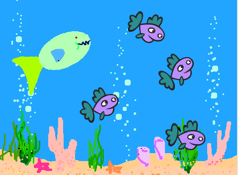

---
title: Menja Peixos
level: Nivell 2
language: ca-ES
stylesheet: scratch
embeds: "*.png"
materials: ["*.sb2", "recursos/*.mp3", "recursos/*.png"]
...

# Introducció {.intro}

Construirem un joc Menja-peixos! Ajudeu al Peix Gros a menjar-se totes les preses que neden al seu voltant. 

Aquest projecte utilitza recursos externs (no inclosos a l'Scratch). Baixeu-vos els vestits __recursos/peix-gros1__ i __recursos/peix-gros2__, i el so __recursos/comp__. Guardeu-los a una carpeta que recordeu. 



<!------------------------------------------------------>
# Pas 1: Creeu un personatge que segueixi el ratolí {.activity}

**Fem que el Peix Gros nedi pel mar!**

## Llista de tasques {.check}

+ Creeu un nou projecte.
+ Seleccioneu l'escenari i cliqueu a la pestanya del Fons. Llavors, seleccioneu el fons **nature/underwater3** i suprimiu-ne l'original.
+ Canvieu el nom del personatge 'Sprite1' per 'Peix Gros'.
+ Seleccioneu de la carpeta on us heu baixat els vestits, el del Peix Gros __peix-gros1__ i borreu els vestits anteriors ('vestit1' i 'vestit2'). 
+ Aneu a la `i` blava del personatge i marqueu el botó amb dues fletxes per tal que el personatge només miri a esquerra o dreta.
+ Creeu el següent programa per fer que el Peix Gros persegueixi el punter del ratolí:
```scratch
	Quan la BANDERA VERDA es premi
    per sempre
        apunta cap a [punter del ratolí v]
        mou-te (3) passos
```

## Proveu el projecte {.flag}

Cliqueu la bandera verda.

+ Moveu el punter del ratolí pel mar. El peix, segueix el punter del ratolí?
+ Què passa si deixeu de moure el ratolí i el peix l'atrapa? Quin aspecte té? Perquè creieu que es comporta d'aquesta forma?
+ Podeu fer que el Peix Gros deixi de tornar-se boig, fent que només es mogui quan no està massa a prop del punter del ratolí. (Trobareu el bloc `distància a` {.blocklightblur} a la paleta de `Sensors`).
```scratch
    Quan la BANDERA VERDA es premi
	per sempre
        si <(distància a [punter del ratolí v]) > (10)>
	        apunta cap a [punter del ratolí v]
		    mou-te (3) passos
```

## Proveu el projecte {.flag}

## Coses per provar {.try}

+ Podeu provar de canviar els números del programa. Al canviar el valor d'aquests números, com canvia la forma de moure's del Peix Gros? 
+ Canvieu la 'distància a punter del ratolí' a un valor més gran (p. ex. 100) o més petit (p. ex. 1). 
+ Canvieu també els passos que el Peix Gros es mou a un valor més gran (p. ex. 20) o més petit (p. ex. 1 o fins i tot 0).

<!------------------------------------------------------>
# Pas 2: Afegiu a la presa {.activity}

Ja és hora de posar alguna cosa que el Peix Gros es pugui menjar!

## Llista de tasques {.check}

+ Creeu un nou personatge utilitzant **Animals/starfish**.
+ Utilitzeu l'eina `Encongir`, situada al menú de l'Scratch per reduir la mida del nou personatge.
+ Creeu un programa que faci que les preses nedin pel mar. El nostre objectiu és que les preses es moguin a l'atzar, per tant farem que repetidament es moguin una mica endavant i llavors girin una mica a esquerra o dreta a l'atzar.
```scratch
	Quan la BANDERA VERDA es premi
	per sempre
		mou-te (2) passos
		gira a la dreta (nombre a l'atzar entre (-20) i (20)) graus
		rebota en tocar una vora
```

## Proveu el projecte {.flag}

Cliqueu la bandera verda i mireu si la presa està nedant pel mar. La presa, neda com us esperàveu? El moviment és realista?

Per ara, el Peix Gros i la presa no interaccionen entre ells. Al següent pas ho resoldrem.

## Deseu el projecte {.save}

## Coses per provar {.try}

+ Intenteu canviar els números dels blocs `número a l'atzar`{.blockgreen} i del moviment. Com canvia el moviment de la presa? 

+ Quina funció té el bloc `rebota en tocar una vora`? Elimineu-lo i observeu que passa. 
  
<!---------------------------------------------------->
# Pas 3: El Peix Gros es menja la presa {.activity}

Ara volem que el Peix Gros es mengi la presa! Hi ha dues coses que haurien de passar un cop que el Peix Gros ha capturat la presa amb la boca:

* El Peix Gros ha de tancar la boca i reproduir el so "chomp".
* La presa ha de desaparèixer, i al cap de poc tornar a aparèixer.

## Llista d'activitats {.check}

+ Primer, farem que la presa desaparegui si està tocant el Peix Gros i reaparegui al cap de 3 segons. Feu servir el bloc `tocant?` {.blocklightblue} per veure si la presa està tocant el Peix Gros.
```scratch
	Quan la BANDERA VERDA es premi
	per sempre		
		mou-te (2) passos
		gira a la dreta (nombre a l'atzar entre (-20) i (20)) graus
		rebota en tocar una vora
		si <tocant [Peix Gros v]?>
			amaga
			espera (3) segons
			mostra
```

## Proveu el projecte {.flag}

Proveu el joc un altre cop. Hi trobeu algun problema? Fixeu-vos que la presa desapareix en tocar qualsevol part del Peix Gran. A més, també es podria donar la situació que el Peix Gran esperés 3 segons i es tornés a menjar la presa en el moment que tornés a aparèixer. Això no és just!

+ Com ho podríem fer perquè la presa només desaparegués si està tocant la boca del Peix Gros? Podríem utilitzar el bloc `tocant el color` {.blocklightblue} i veure si està tocant la dent blava del Peix Gros. Per provar aquesta opció, canvieu el bloc `tocant` {.blocklightblue} pel bloc `tocant el color` {.blocklightblue} al programa, cliqueu al selector de color del bloc i seguidament a la dent del Peix Gros. 
+ Seguidament, fent servir el bloc `ves a` {.blockblue} amb valors a l'atzar pels valors **x** i **y**, podem fer que la presa es mogui a un punt aleatori abans de reaparèixer de nou a l'escenari.
```scratch
	quan la BANDERA VERDA es premi
	per sempre		
		mou-te (2) passos
		gira a la dreta (nombre a l'atzar entre (-20) i (20)) graus
		rebota en tocar una vora
		si <tocant el color [#000000]?>, llavors
			amaga
			espera (3) segons
			vés a x: (nombre a l'atzar entre (-220) i (220)) y: (nombre a l'atzar entre (-170) i (170))
			mostra
```

## Proveu el projecte {.flag}

Proveu el joc un altre cop: la presa, només desapareix quan toca la boca del peix? Reapareix en un punt a l'atzar de l'escenari en comptes del mateix lloc on el Peix se l'havia menjat?

El peix ha de saber quan s'ha empassat alguna cosa per poder reproduir un so i canviar de vestit. Per fer això, podem fer que la presa, abans de desaparèixer, enviï un missatge indicant que se l'han empassat. 
```scratch
    quan la BANDERA VERDA es premi
	per sempre		
		mou-te (2) passos
		gira a la dreta (nombre a l'atzar entre (-20) i (20)) graus
		rebota en tocar una vora
		si <tocant el color [#000000]?>, llavors
            envia a tots [menjat! v]
			amaga
			espera (3) segons
			vés a x: (nombre a l'atzar entre (-220) i (220)) y: (nombre a l'atzar entre (-170) i (170))
			mostra
```

Ara volem que el Peix Gros respongui a aquest missatge reproduint el so 'chomp' i tancant la boca.

+ Afegiu el vestit **mouth-closed.png** i el so **chomp.mp3**, de la carpeta dels recursos, al personatge Peix Gros.
+ Llavors, afegiu un nou programa al Peix Gros per tal que respongui al missatge de la presa. Aquest programa hauria de fer que el peix reprodueixi el so 'chomp', canviés al vestit amb la boca tancada, esperés una mica i tornés de nou al vestit original.
```scratch
    quan rebi [menjat! v]
	    toca el so [chomp v]
	    repeteix (2) vegades
	        canvia el vestit a [peix-gros2 v]
		    espera (0.5) segons
		    canvia el vestit a [peix-gros1 v]
```

Ara que el Peix Gros estàs llest, omplim l'oceà amb preses! Cliqueu amb el botó dret a la presa i seleccioneu 'duplica' varies vegades.

## Proveu el projecte {.flag}

Cliqueu la bandera verda. 

+ El Peix Gros, es menja la presa? Ho fa amb totes les preses?

## Deseu el projecte {.save}

## Coses a pensar

Perquè tenim que afegir el bloc `mostra` {.blockblue} al començament del programa de la presa?  Penseu que passaria si la presa fos empassada i el joc s'aturés abans de que reaparegués. Què passaria si el joc es reiniciés en aquest mateix instant?

__Ben fet! Heu acabat el joc principal.  Però hi han moltes coses més que podeu fer-hi al joc.  Accepteu un desafiament?__

<!-------------------------------------------------------------------------------->
## Desafiament 1: Feu que la presa es mogui de forma diferent {.challenge}

Fins aquest moment, totes les preses es mouen de la mateixa forma. Podríeu fer que una d'elles es mogués de forma diferent? **Pista:** No us passeu molt de temps amb aquesta part sense mirar primer la resta d'activitats del projecte.

__Seleccioneu un presa per fer-hi proves.__ Si aquesta presa té el mateix vestit que la resta, canvieu-li el color utilitzant el bloc `fixa efecte color a` {.blockpurple} per tal de diferenciar-la de la resta.

Feu que aquesta presa es mogui més lentament que la resta. **Pista:** Mireu el bloc del programa `mou-te 2 passos` {.blockblue}.

## Proveu el projecte {.flag}

La presa, es mou més lentament? El fet que es mogui més lentament fa el joc millor? 
Si podeu fer això, també podeu __fer que un peix es mogui més de pressa que la resta.__

La presa, es mou encara de forma raonable? El fet que es mogui més ràpida fa el joc millor? **Pista:** Si la presa neda en cercles, verifiqueu que els valors dels blocs `nombre a l'atzar` {.blockgreen}

Què tal si feu que la presa es comporti de forma diferent, utilitzant diferents combinacions d'aquestes modificacions?

Aquests canvis, fan que el joc sigui millor? Fan el joc més interessant, divertit, difícil o fàcil? Quina versió és millor?

## Deseu el projecte {.save}

<!-------------------------------------------------------------------------------->
## Desafiament 2: Feu que la presa eviti al Peix Gros {.challenge}

En aquest joc, la presa és una mica ruca! Simplement neda pel mar a l'atzar fins que se la mengen. Els peixos de veritat intenten fugir dels seus depredadors. __Fem que una presa del joc nedi fugint del Peix Gros.__

No hi ha cap bloc a l'Scratch que ens pugui dir la direcció d'algun altre personatge del mateix escenari. Però sí que podeu fer que un personatge apunti cap a un altre i que després giri cua. Els blocs que necessiteu es troben a la paleta de __Moviment__. 

Fent servir aquesta idea, __feu que una de les preses sempre s'allunyi del Peix Gros.__ Fins i tot podríeu fer que fugis fent ziga-zagues.   

## Proveu el projecte {.flag}

Aquesta modificació, fa que la presa sigui més difícil de capturar? Fa que el joc sigui millor?

## Deseu el projecte {.save}

<!-------------------------------------------------------------------------------->
## Desafiament 3: Afegiu un marcador {.challenge}

No n'hi ha prou de menjant-se la presa. Com podeu saber que se us dóna millor que als vostres amics? Necessiteu un sistema per mantenir un marcador. Mireu la tarja d'Scratch **Guardeu els punts** per saber com fer-ho.

A on hauríeu de posar els blocs que canviarien el marcador?

Al començar la partida, assegureu-vos que el marcador sempre comença a zero. A on posaríeu aquest bloc?

## Proveu el projecte {.flag}

El marcador, està a zero al principi de la cada partida? Puja cada cop que us mengeu una nova presa?

## Deseu el projecte {.save}

<!-------------------------------------------------------------------------------->
## Desafiament 4: Afegiu un compte enrere {.challenge}

Doneu-vos un temps límit per partida. Quants peixos sou capaços de menjar-vos en trenta segons?

Mireu a la tarja d'Scratch **Cronòmetre** per saber com afegir un cronòmetre al joc. Comenceu el joc amb un temps límit de 30 segons.

## Proveu el projecte {.flag}

El cronòmetre, comença a 30 segons? 

Va baixant a la velocitat correcta? 

Podeu capturar la presa mentre el cronòmetre està en marxa? 

El joc, es para un cop el cronòmetre arriba a zero?

## Deseu el projecte {.save}

<!-------------------------------------------------------------------------------->
## Desafiament 5: Afegiu un marcador de punts extra {.challenge}

Afegiu punts extres al marcador si aconseguiu empassar-vos tres peixos alhora. Com podríeu saber quants peixos us heu empassat?

**Pista:** Una forma d'aconseguir-ho utilitza un variable per comptar quantes preses hi ha nedant al mar.

## Deseu el projecte {.save}

<!-------------------------------------------------------------------------------->
## Desafiament 6: Invertiu el joc: Mantingueu la presa sempre amb vida! {.challenge}

A vegades, les millors idees sorgeixen al donar-li la volta a una idea inicial.

__Modifiqueu el joc de forma que, en comptes de controlar al Peix Gros que intenta menjar-se a la resta, controleu una presa que neda pel mar entre molts Peixos Grossos.__ Quant de temps podeu sobreviure abans que se us empassin?

## Deseu el projecte {.save}

Ben fet, ja heu acabat. Ara podeu gaudir del joc! No oblideu de que podeu compartir el vostre joc amb tots els vostres amics i familiars clicant **Comparteix** a la barra de menú.

