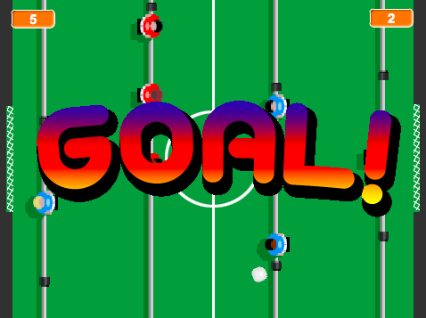

---
title: Futbolí Scratch
level: Nivell 3
stylesheet: scratch
language: ca-ES
embeds: "*.png"
...


<!---->

<!-- 
////////////////////////////////////////////////////////////////////// 
////////////////////////////////////////////////////////////////////// 
-->

## Projecte de contribució de la comunitat { .challenge }

Aquest projecte ha estat possible gràcies a [Mark Hardisty](https://twitter.com/hardistymark) (idea i diseny original) i [Codeclubcat](https://codeclubcat.org) (traducció, edició i formateig a projecte Code Club).

<!--
*************************************************************************************************


Pràctica creada per: Mark Hardisty i Andy Lulham
Traducció: Codeclubcat.org
Pràctica 1 2n Trimestre. Nivell 3.
	
	
*************************************************************************************************
-->

# Introducció { .intro }


En aquest projecte crearem una copa del món de futbol amb Scratch!

<!-- 
////////////////////////////////////////////////////////////////////// 
////////////////////////////////////////////////////////////////////// 
-->

# Pas 1: Preparar el terreny de joc { .activity }

## Llista de tasques { .check }

+ Comenceu un projecte nou de Scratch. Aneu a la finestra **personatges** Elimineu el gat (premeu el botó dret damunt del gat i llavors **esborra** . Si aquesta instrucció no funciona, premeu majúscules i apreteu el botó esquerra del ratolí).
+ Aneu a l'**escenari**. Seleccioneu l'opció de `pujar un fons des d'un fitxer`. Seleccioneu la imatge **pitch** de la carpeta de recursos de la pràctica.
+ Elimineu el fons de color blanc original. Ho podeu fer anant a la pestanya de `Fons`. 
+ Les nostres porteries necessiten xarxes!!! Creeu un nou personatge utilitzant `Puja un personatge des d'un fitxer`. Seleccioneu la imatge **net** de la carpeta de recursos.
+ Mou el personatge que acabes de crear al mig de la porteria del cantó esquerre del terreny de joc.
+ Canvia-li el nom al personatge i posa-li el nom de **porteria blava**.
+ Premeu el botó dret del ratolí sobre del personatge i premeu `duplica`. Llavors moveu aquest nou personatge al mig de la porteria dreta i canvieu-li el nom per **porteria vermella**.

## Deseu el projecte { .save }

<!-- 
////////////////////////////////////////////////////////////////////// 
////////////////////////////////////////////////////////////////////// 
-->

##Pas 2: Afegir un porter {.activity}

De moment el terreny de joc té molt bona pinta! Ara toca afegir alguns jugadors i fer que es moguin. 

## Llista d'activitats { .check }

+ Creeu un nou personatge prement `Puja un personatge des d'un fitxer` i seleccioneu la imatge **goalie blue** de la carpeta de recursos de la pràctica. Canvieu-li el nom al nou personatge i poseu-li **porter blau**. 
+ Moveu el personatge fins a situar-lo davant de la porteria esquerre. 
+ Premeu al botó `creix` i després premeu 10 vegades el personatge **porter blau** fins a fer-lo créixer 10 vegades.
+ Cliqueu la pestanya de `Programes` i afegiu el codi següent:
```scratch
   quan la BANDERA VERDA es premi
   vés a x: (-190) y: (0)
    per sempre
        si <<tecla [q v] premuda?> i <(posició y) < [80]>> llavors
            suma (5) a y
        fi
        si <<tecla [a v] premuda?> i <(posició y) > [-80]>> llavors
            suma (-5) a y 
        fi
    fi
```

Mireu un moment el programa que heu creat. Primer posem el porter al lloc d'inici i després el bucle _per sempre_ està escoltant tota l'estona fins que un jugador premi la tecla **Q** o la tecla **A**. Quan un jugador prem la tecla **Q** el porter es mourà cap a dalt, i quan premi la tecla **A** el porter es mourà cap avall. El programa que heu escrit també comprova la `posició y`{ .blockblue } perquè el porter no surti de la pantalla (entre la posició y que va de -80 a 80). 


## Proveu el projecte { .flag }

Cliqueu la bandera verda. 

+ Podeu controlar el moviment del porter amb les tecles Q i A?
+ Què passa quan el porter toca els límits de la pantalla del joc?

## Deseu el projecte { .save }

<!-- 
////////////////////////////////////////////////////////////////////// 
////////////////////////////////////////////////////////////////////// 
-->

##Pas 3: Afegir més jugadors {.activity}

No podem jugar a un partit de futbol només amb un jugador! Necessitem afegir-ne més. 

## Llista d'activitats { .check }

+ Creeu un nou personatge prement `Puja un personatge des d'un fitxer` i seleccioneu la imatge **goalie red** de la carpeta de recursos de la pràctica. 
+ Canvieu-li el nom al nou personatge i poseu-li **porter vermell**. 
+ Arrossega el personatge fins que estigui situat davant de la porteria dreta. 
+ Igual que heu fet abans, cliqueu el botó **creix** i féu créixer el personatge 10 vegades clicant sobre d'ell 10 cops. 
+ Arrossegueu el programa del **porter blau** que heu creat abans sobre el personatge **porter vermell** per copiar el codi al nou personatge.
+ Vés al personatge **porter vermell** i modifica el programa que li has copiat de la manera següent:
	Només haureu de canviar dues coses, la `posició x`{ .blockblue} i les tecles que hauràs de prémer: "p" i "l".
```scratch
   quan la BANDERA VERDA es premi
   vés a x: (190) y: (0)
    per sempre
        si <<tecla [p v] premuda?> i <(posició y) < [80]>> llavors
            suma (5) a y
        fi
        si <<tecla [l v] premuda?> i <(posició y) > [-80]>> llavors
            suma (-5) a y 
        fi
    fi
```

## Proveu el projecte { .flag }

Premeu bandera verda.

+ Podeu controlar el moviment del porter vermell amb les tecles P i L?
+ Encara funcionen les tecles per moure el porter blau?


## Deseu el projecte { .save }


<!-- 
////////////////////////////////////////////////////////////////////// 
////////////////////////////////////////////////////////////////////// 
-->

##Pas 4: Afegir jugadors atacants {.activity}

## Llista d'activitats { .check }

+ Creeu un nou personatge prement `Puja un personatge des d'un fitxer` i seleccioneu la imatge **attack blue** de la carpeta de recursos de la pràctica. 
+ Canvieu-li el nom al nou personatge i poseu-li **atacant blau**. 
+ Arrossega el personatge fins que estigui situat davant del porter vermell, a la dreta de la pantalla. 
+ Igual que heu fet abans, cliqueu el botó **creix** i féu créixer el personatge 10 vegades clicant sobre d'ell 10 cops. 
+ Arrossegueu el programa del **porter blau** que heu creat abans sobre el personatge **atacant blau** per copiar el codi al nou personatge.
+ Vés al personatge **atacant blau** i modifica el programa que li has copiat de la manera següent:
Només haureu de canviar dues coses, la `posició x` {.blockblue} i les tecles que hauràs de prémer: "w" i "s". 
```scratch
   quan la BANDERA VERDA es premi
   vés a x: (70) y: (0)
    per sempre
        si <<tecla [w v] premuda?> i <(posició y) < [80]>> llavors
            suma (5) a y
        fi
        si <<tecla [s v] premuda?> i <(posició y) > [-80]>> llavors
            suma (-5) a y 
        fi
    fi
```

+ Creeu un nou personatge prement `Puja un personatge des d'un fitxer` i seleccioneu la imatge **attack red** de la carpeta de recursos de la pràctica. 
+ Canvieu-li el nom al nou personatge i poseu-li **atacant vermell**. 
+ Arrossega el personatge fins que estigui situat davant del porter blau, a l'esquerre de la pantalla. 
+ Igual que heu fet abans, cliqueu el botó **creix** i féu créixer el personatge 10 vegades clicant sobre d'ell 10 cops. 
+ Arrossegueu el programa del _atacant_ _blau_ que heu creat abans sobre el personatge **atacant vermell** per copiar el codi al nou personatge.
+ Vés al personatge **atacant vermell** i modifica el programa que li has copiat de la manera següent:
Només haureu de canviar dues coses, la `posició x`{ .blockblue} i les tecles que hauràs de prémer: "o" i "k". 
```scratch
   quan la BANDERA VERDA es premi
   vés a x: (-70) y: (0)
    per sempre
        si <<tecla [o v] premuda?> i <(posició y) < [80]>> llavors
            suma (5) a y
        fi
        si <<tecla [k v] premuda?> i <(posició y) > [-80]>> llavors
            suma (-5) a y 
        fi
    fi
```

## Proveu el projecte { .flag }

Premeu bandera verda.

+ Ja teniu dos equips per jugar?
+ Per controlar l'equip blau haureu de prémer les tecles Q, A, W, S.
+ Per controlar l'equip vermell haureu de prémer les tecles P, L, O, K.

## Deseu el projecte { .save }

<!-- 
////////////////////////////////////////////////////////////////////// 
////////////////////////////////////////////////////////////////////// 
-->


##Pas 5: Afegir una pilota que reboti {.activity}

El nostre joc de futbol té molts **peus** però cap **pilota**!! hem d'arreglar-ho.

## Llista d'activitats { .check }

+ Creeu un nou personatge prement `Puja un personatge des d'un fitxer` i seleccioneu la imatge **ball** de la carpeta de recursos de la pràctica. 
+ Canvieu-li el nom al nou personatge i poseu-li **pilota**. 
+ A la pestanya de `Programes` del personatge **pilota**, afegeix el codi següent:
```scratch
   quan la BANDERA VERDA es premi // rebotar
   envia a tots [iniciarpilota v]
    per sempre
        mou-te (10) passos
        rebota en tocar una vora
    fi
```

+ Cliqueu sobre del programa amb el botó dret del ratolí i premeu `afegeix un comentari`. Afegiu el comentari **"rebotar pilota"**.
+ Afegiu un altre tros de codi al personatge **pilota**:
```scratch
   quan rebi [iniciarpilota v] // preparació per començar
   vés a x: (0) y: (0)
   apunta en direcció <nombre a l'atzar entre (1) i (360)>
```
 
 Aquest codi fa que la pilota es posi al mig del camp quan es comença el partit. I després, fa que apunti a una direcció aleatòria. Per què utilitzem el missatge `iniciarpilota` { .blockorange }?

 + No oblideu d'afegir el comentari **"preparació per començar"**, per poder recordar més endavant què fa el nostre tros de codi!


## Proveu el projecte { .flag }

Premeu bandera verda.

+ Es mou la pilota?
+ Què pasa quan toca les vores de la pantalla?
+ Esteu contents amb a velocitat en què es mou? Intenteu modificar el bloc `mou-te` { .blockblue } per canviar la velocitat de la pilota. Podeu fer que es mogui més ràpid o més lent, configureu-ho al vostre gust!
+ Què passa quan la pilota toca als jugadors?

## Deseu el projecte { .save }

<!-- 
////////////////////////////////////////////////////////////////////// 
////////////////////////////////////////////////////////////////////// 
-->


##Pas 6: Xutar la pilota {.activity}

Necessitem que la pilota reboti quan toca els peus dels jugadors.

## Llista d'activitats { .check }

+ Modifiqueu el programa anterior de la pilota (**"rebotar"**) per tal de que es vegi així:
```scratch
   quan la BANDERA VERDA es premi // rebotar
   envia a tots [iniciarpilota v]
    per sempre
        mou-te (10) passos
        rebota en tocar una vora
		si <<tocant el color [#0A9AF7]?> o <tocant el color [#FF0D01]?>>
            gira a l'esquerra (nombre a l'atzar entre (140) i (220)) graus
        fi
    fi
```

Haureu de seleccionar els colors clicant als jugadors de futbol. Aquest canvi al programa fa que la pilota reboti quan toca a algun jugador i que es desvïi uns graus (aleatoris).

## Proveu el projecte { .flag }

Premeu bandera verda.

+ Què passa quan la pilota toca als jugadors? 
+ Funciona pels jugadors dels dos equips (blau i vermell)?

## Deseu el projecte { .save }

<!-- 
////////////////////////////////////////////////////////////////////// 
////////////////////////////////////////////////////////////////////// 
-->

##Pas 7: Gooooooool!!!!!!!! {.activity}

## Llista d'activitats { .check }

+ Seleccioneu la **porteria vermella** i afegiu el següent programa:
```scratch
    quan la BANDERA VERDA es premi // tecnologia de la línia de gol
       per sempre
        si <tocant [pilota v]> llavors
            envia a tots [gol v]
        fi
    fi
```

Aquest programa funciona com la **tecnologia de la línia de gol**: funciona tota l'estona, comprovant sempre si està tocant la pilota o no, i quan la porteria toca la pilota envia un missatge de gol a tothom.

+ Arrossega aquest programa al personatge **porteria blava** per copiar el codi a l'altra porteria.
+ Ara necessitem fer alguna cosa amb el missatge que envien les porteries quan és gol. Premeu `Puja un personatge des d'un fitxer`.
+ Seleccioneu la imatge **goal_text** de la carpeta de recursos de la pràctica. 
+ Poseu el següent nom al personatge: **text de gol**.
+ Afegiu el programa següent al personatge **text de gol**
```scratch
    quan rebi [gol v] // goal scored
    mostra't
    espera (1) segons
    amaga't
```
+ Finalment afegeix un programa més al personatge **text de gol** per tal d'assegurar-nos que el missatge de gol s'amaga a l'inici del joc:
```scratch
    quan la BANDERA VERDA es premi
    amaga't
```

## Deseu el projecte { .save }

## Proveu el projecte { .flag }

Ja teniu el joc apunt per jugar-hi!!!! Premeu bandera verda.

+ Què passa quan la pilota comença a moure's?
+ Busca un company per jugar-hi!

<!-- 
////////////////////////////////////////////////////////////////////// 
////////////////////////////////////////////////////////////////////// 
-->

## Repte 1: Mantenir la puntuació { .challenge }

+ Podeu afegir variables que mostrin la puntuació pels dos equips?

## Repte 2: Inclinar el futbolí { .challenge}

+ A vegades la pilota es queda encallada i comença a rebotar entre dos llocs on els jugadors no arriben per tocar-la i desencallar-la. Podeu afegir un programa que **inclini el futbolí** quan es premi la tecla **espai** i que solucioni aquest problema?

## Repte 3: El xiulet de l'àrbitre { .challenge }

+ Podeu afegir un xiulet de l'àrbitre cada vegada que el joc comenci? podeu utilitzar el so **whistle** de la carpeta de recursos de la pràctica.

## Deseu el projecte { .save }
